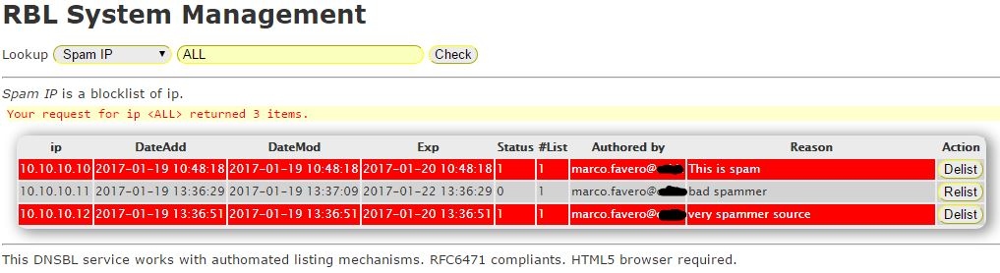

[](https://scrutinizer-ci.com/g/falon/RBL/build-status/master)
# RBL Manager
A complete RBL Management System, with interfaces to Splunk Alert and trap or learning mailboxes.


## Abstract
A complete tool to create and manage a time expiring lists of IP, networks, usernames and email address.
All the active members can be exported into RBLDNS zone format. The lists are stored into MySQL server, which can be accessed by Postfix for any policy enforcements. A Splunk alert interface allow an authomated listing mechanism to block SPAM source. Spam or ham mailboxes can be queried to list source ips. A Postfix miltertable can be configured with your milter configurations.
Every member in list can be active (really listed), or inactive (time expired, or deactivated by administrative task).

## Requisite

- PHP >= 7.1 with your date.timezone in php.ini
- MySQL Server > 5.6.4 (supporting transaction and foreign key)
- php-gmp and dautkom/php.ipv4
- RBLDNS, if you export file zone through RBLDNS Export Plugin.
- Splunk with webhook for the Splunk List Plugin
- php-ldap for the Amavis Export Plugin
- php-imap, php-xml and Splunk SDK for the SPAM Learn Observer

## Basic Installation
### By RPM
Red Hat 7 ready? See at the build folder and install the RPM file:
`yum install https://github.com/falon/RBL/raw/master/contrib/RPM/rblmanager-<version>.el7.noarch.rpm`
Your system may complain that no php-7 package can be found. You can try with the [Remi distribution](https://rpms.remirepo.net/).

### By source
Otherwise you can try these lapidary instructions.
Clone this repository.

From home directory type `composer require dautkom/php.ipv4`.

Move the doc and contrib folders to /usr/local/RBL or other location. Or don't move at all, if you like.
Move
```
ajaxsbmt.js
pleasewait.gif
style.css
```
to `/include` folder relative to Document Root of web server.

Copy config.php-default to config.php
You must now configure crontab or systemd script at your need. For each plugin you are using configure paths and configuration files.

## Configuration
Please, follow these steps even if you installed RBL Manager by RPM.
### Database MySQL
Check at the `doc/db.sql` and `doc/grant.sql`. Default values work only with provided default config. Arrange them in your environment.
You can separate the MySQL host from the web host.
```
mysql -u root < doc/db.sql
mysql -u root < doc/grant.sql
```
### config.php

Customize the DB part ($dbhost, $userdb, $db, $pwd)

Customize the tables ($tables) you want. These are the lists. List types are classified by "field". There are:

- ip (list of IP exportable to rbldns format through RBLDNS Export Plugin)
- network (list of CIDR networks exportable to rbldns format through RBLDNS Export Plugin)
- username (list of username, maybe useful to Postfix policy over sasl_username, if you like)
- email (list of email addresses, useful to Postfix policy over sender email addresses, if you like)
- domain (list of domains, exportable to rbldns format such as URIBL or SURBL)

Every list name and key must be unique. If set to FALSE, the field "active" makes the list inexistent.
The "limit" field configures the maximum number of active members in every list.
The "bl" field identifies the list as a blocklist (TRUE) or a whitelist (FALSE), but it is quite useless. It just helps you to make a sane employ of the list.
The "depend" field defines constraint through lists. For instance, a spam listed item can't be subscribed to a whitelist.
The "milter" field provides a list of ips or networks to use whitin Postfix miltermap table. See at the Wiki for more details.

The admins can list and relist items by hand through the web GUI. The superadmins (TRUE) can  list and relist up to years intervals. The list and relist facility is allowed only if you enable "require_auth", for safety reason. List and other actions are logged with the authenticated credential.

### Expire task
Install the expire daily task to prevent an indefinitely DB growing. A systemd timer is included in the RPM package. Otherwise you can install a crontab such as
```
ln -s /usr/local/RBL/contrib/expire.php /etc/cron.daily/expireRBL.php
```
It will remove all items expired for at least one year, or other specified in `$expireTime`. Expiration must also be activated (`$expire = TRUE`), see at `config.php`.

## Hint populating networks
### Included networks
You can't add a new network included into an already existing network. This restriction avoids unnecessary disorder and it is valid for all network lists. You can delete the larger network before to add the smaller one.
### Overlapping networks
Again, you can't add a network intersecting an existing network. All networks you enter must not overlap. Applications like RBLDNS for networks set use for result only the larger network found. Networks which don't overlap avoid misunderstanding and unpredictable behaviour.

Milter neworks come to work with Postfix miltermap tables. In this case, you can define overlapping networks. In particular, you can define a network larger than another already defined. But remember that the query must return only 'DISABLE' if multiple results occur. A query like we provide in the documentation (_smtpd_miltermap_ file) works.

## Plugin

The plugins are the real useful core of the lists. See at the [wiki](https://github.com/falon/RBL/wiki).
